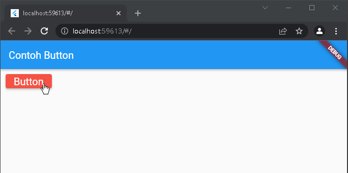

# basic_flutter

NIM: 2031710168
Nama: M. Afada Nur Saiva Syahira  
Kelas: MI-2F
Prodi: D3-MI

A new Flutter project

## Hasil Praktikum
## Widget
1. Text Widget

2. Image Widget

3. iOS Cupertino 

4. Button

5. Scaffold

6. Dialog

7. Input dan Selection Widget

8. Date and Time Pickers

## Layout
9. Container - Property Child

10. Container - Property Alignment

11. Container - Property Color

12. Container - Property Height Width

13. Container - Property Margin

14. Container - Property Padding

15. Container - Property Transform

16. Container - Property Decoration

17. Column

18. Row

19. Stack

20. ListView

21. Grid View

## TUGAS

